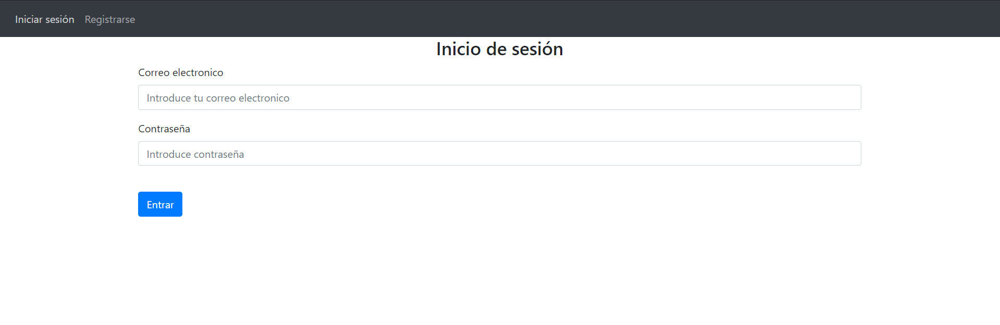
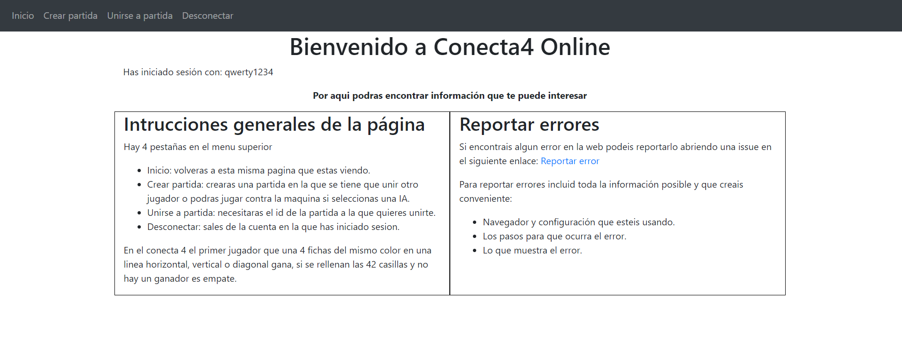
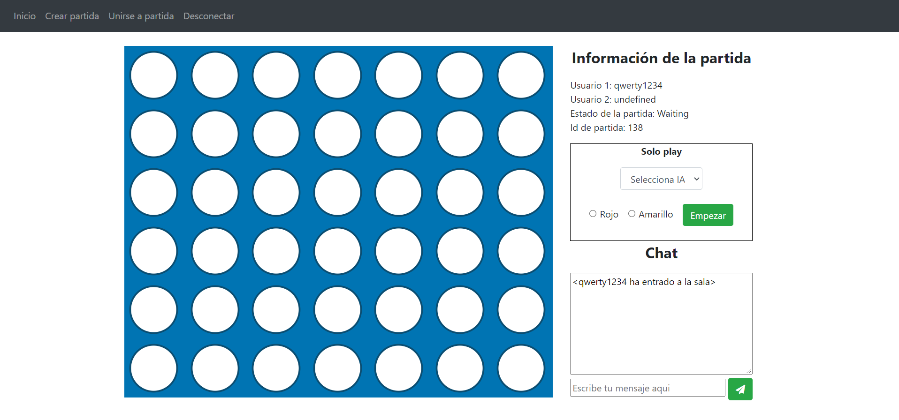

<!--
*** Thanks for checking out the Best-README-Template. If you have a suggestion
*** that would make this better, please fork the repo and create a pull request
*** or simply open an issue with the tag "enhancement".
*** Thanks again! Now go create something AMAZING! :D
***
***
***
*** To avoid retyping too much info. Do a search and replace for the following:
*** github_username, repo_name, twitter_handle, email, project_title, project_description
-->


<!-- PROJECT SHIELDS -->
<!--
*** I'm using markdown "reference style" links for readability.
*** Reference links are enclosed in brackets [ ] instead of parentheses ( ).
*** See the bottom of this document for the declaration of the reference variables
*** for contributors-url, forks-url, etc. This is an optional, concise syntax you may use.
*** https://www.markdownguide.org/basic-syntax/#reference-style-links
-->

<!-- PROJECT LOGO -->
<br />
<p align="center">
  <h1 align="center">Web Conecta 4</h1>

  <p align="center">
    Flask webserver que aloja el juego conecta 4
    <br />
    <a href="https://github.com/JoseAntonioVelasco/Python_Conn4Web">Ver demo</a>
    ·
    <a href="https://github.com/JoseAntonioVelasco/Python_Conn4Web/issues">Reportar un error</a>
    ·
    <a href="https://github.com/JoseAntonioVelasco/Python_Conn4Web/issues">Contribuye</a>
  </p>
</p>


<!-- TABLE OF CONTENTS -->
<details open="open">
  <summary><h2 style="display: inline-block">Tabla de Contenidos</h2></summary>
  <ol>
    <li>
      <a href="#sobre-el-proyecto">Sobre el proyecto</a>
      <ul>
        <li><a href="#hecho-con">Hecho con</a></li>
      </ul>
    </li>
    <li>
      <a href="#empezando">Empezando</a>
      <ul>
        <li><a href="#prerrequisitos">Prerrequisitos</a></li>
        <li><a href="#instalación-del-proyecto">Instalación</a></li>
      </ul>
    </li>
    <li><a href="#ejecutar-el-proyecto">Ejecutar el proyecto</a></li>
    <li><a href="#contribuye">Contribuye</a></li>
    <li><a href="#licencia">Licencia</a></li>
    <li><a href="#contacto">Contacto</a></li>
  </ol>
</details>


<!-- ABOUT THE PROJECT -->
## Sobre el proyecto

Proyecto final para el grado superior Desarrollo de Aplicaciones Multiplataforma.

Web simple desarrollada en Python en la que los usuarios registrados podran jugar al Conecta 4 contra otros usuarios o en solitario contra unas inteligencias artificiales programadas en javascript.

### Hecho con

* []() Python3
* []() Flask framework
###

Utilizando el editor de codigo fuente VSCode con las siguientes extensiones instaladas: 
* []() AREPL
* []() Jinja
* []() Prettier
* []() Python Docstring Generator
* []() MarkDownLint
* []() SQLite
<!-- GETTING STARTED -->
## Empezando

Para conseguir una copia del proyecto y poner el proyecto a funcionar sigue los siguientes pasos.

### Prerrequisitos

Tienes que tener un interprete de python3 instalado en el ordenador, puedes conseguir uno del siguiente enlace: https://www.python.org/downloads/.

Para clonar repositorios tambien es necesario tener git instalado, desde la siguiente pagina lo puedes descargar: https://git-scm.com/.

Para comprobar la correcta instalacion de python puedes utilizar el siguiente comando
   ```sh
   python --version
   ```
Para comprobar la correcta instalacion de git puedes utilizar el siguiente comando: 
   ```sh
   git --version
   ```
### Instalación del proyecto

1. Clona el repositorio
   ```sh
   git clone https://github.com/JoseAntonioVelasco/Python_Conn4Web.git
   ```
2. Crea un entorno virtual
   ```sh
   python -m venv "nombre del entorno virtual"
   ```
3. Activa el entorno virtual (Windows)
   ```sh
   "nombre del entorno virtual"/scripts/activate
   ```
   (Linux)
   ```sh
   source "nombre del entorno virtual"/bin/activate
   ```
2. Instala los requisitos dentro del entorno virtual
   ```sh
   pip install -r requirements.txt
   ```


<!-- USAGE EXAMPLES -->
## Ejecutar el proyecto
Una vez ya instalado el proyecto para ejecutarlo tenemos que tener activo el entorno virtual del proyecto y después solo hace ejecutar el siguiente comando: 
   ```sh
   python app.py
   ```
En la primera ejecución se creara la base de datos.

En este apartado adjunto unas imagenes en las que ve como es la web en funcionamiento, si probais el proyecto y no se me parecido a lo que se ve en las siguientes imagenes es porque algo debe de estar funcionando mal.

**Inicio de sesión**

**Inicio**

**Crear Partida**



<!-- CONTRIBUTING -->
## Contribuye

Las contribuciones son lo que hacen que la comunidad de código abierto sea un lugar tan increíble para aprender, inspirar y crear. Cualquier contribución que se haga es **muy apreciada**.

1. Haz un fork del proyecto
2. Crea tu propia rama para Caracteristica(`git checkout -b caracteristica/IncreibleCaracteristica`)
3. Haz un commit de tus cambios (`git commit -m 'Incluye alguna IncreibleCaracteristica'`)
4. Haz un push a tu rama (`git push origin caracteristica/IncreibleCaracteristica`)
5. Abre un pull request

<!-- LICENSE -->
## Licencia

Distribuido bajo la licencia MIT. Ver `LICENSE` para más información.

<!-- CONTACT -->
## Contacto

Jose Antonio Velasco - jose.antonio.velasco.monje@gmail.com

Project Link: [https://github.com/JoseAntonioVelasco/Python_Conn4Web](https://github.com/JoseAntonioVelasco/Python_Conn4Web)


<!-- MARKDOWN LINKS & IMAGES -->
<!-- https://www.markdownguide.org/basic-syntax/#reference-style-links -->
[contributors-shield]: https://img.shields.io/github/contributors/github_username/repo.svg?style=for-the-badge
[contributors-url]: https://github.com/github_username/repo/graphs/contributors
[forks-shield]: https://img.shields.io/github/forks/github_username/repo.svg?style=for-the-badge
[forks-url]: https://github.com/github_username/repo/network/members
[stars-shield]: https://img.shields.io/github/stars/github_username/repo.svg?style=for-the-badge
[stars-url]: https://github.com/github_username/repo/stargazers
[issues-shield]: https://img.shields.io/github/issues/github_username/repo.svg?style=for-the-badge
[issues-url]: https://github.com/github_username/repo/issues
[license-shield]: https://img.shields.io/github/license/github_username/repo.svg?style=for-the-badge
[license-url]: https://github.com/github_username/repo/blob/master/LICENSE.txt
[linkedin-shield]: https://img.shields.io/badge/-LinkedIn-black.svg?style=for-the-badge&logo=linkedin&colorB=555
[linkedin-url]: https://linkedin.com/in/github_username